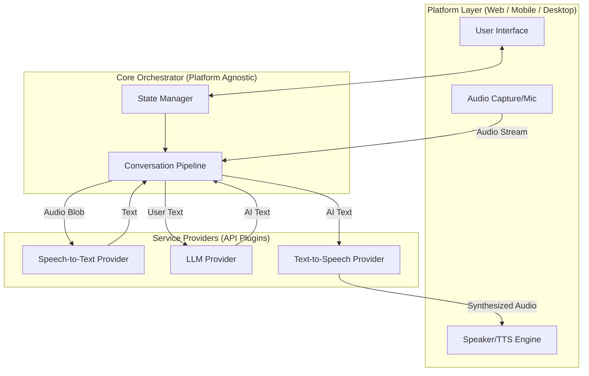

# Cross-Platform AI Voice Chat Abstraction

The current `VoiceChatApp` implementation tightly couples platform-specific web APIs (like `MediaRecorder` and `window.speechSynthesis`) with business logic and third-party API calls (Google Speech-to-Text, Gemini) all within a single React component (`App.tsx`). 

To make this application cross-platform (e.g., adaptable for React Native, Desktop apps, or Server-side bots), we must decouple these concerns into a **modular, protocol-oriented architecture**.

---

## 1. High-Level Architecture Diagram

By breaking down the pipeline, we separate the **Platform-Specific Layers** (Audio I/O, UI) from the **Agnostic Core Logic** and **Service Providers**.



---

## 2. Core Interfaces

These TypeScript interfaces define the contracts that any platform or service must implement. This allows you to swap out Google STT for OpenAI Whisper, or Web Audio for React Native Audio, without changing the core logic.

### A. Audio Input (Platform Specific)
Handles accessing the microphone and capturing audio bytes.
```typescript
interface IAudioRecorder {
  startRecording(): Promise<void>;
  stopRecording(): Promise<Blob | Buffer>;
  onDataAvailable?(chunk: any): void;
}
```

### B. Speech-to-Text (Service Specific)
Handles converting audio payloads into text transcripts.
```typescript
interface ISpeechToTextProvider {
  transcribe(audioData: Blob | Buffer): Promise<string>;
}
```

### C. Language Model (Service Specific)
Handles the AI conversation logic.
```typescript
interface ILLMProvider {
  generateResponse(prompt: string, context?: any): Promise<string>;
  // Can be extended to support streaming responses
}
```

### D. Text-to-Speech (Platform or Service Specific)
Handles synthesizing text into audio and playing it.
```typescript
interface ITextToSpeechProvider {
  speak(text: string): Promise<void>;
  stop(): void;
  onPlaybackComplete?(callback: () => void): void;
}
```

---

## 3. The Orchestrator (The Controller)

The Orchestrator glues these interfaces together. It manages the state (`isRecording`, `isProcessing`, `isPlaying`) and the data flow, completely agnostic to whether it is running on a Web Browser or a Mobile Phone.

```typescript
class VoiceChatController {
  constructor(
    private audioRecorder: IAudioRecorder,
    private sttProvider: ISpeechToTextProvider,
    private llmProvider: ILLMProvider,
    private ttsProvider: ITextToSpeechProvider
  ) {}

  async handleUserInteraction() {
    if (this.isPlaying) {
      this.ttsProvider.stop();
      return;
    }
    
    if (this.isRecording) {
      const audioData = await this.audioRecorder.stopRecording();
      await this.processTurn(audioData);
    } else {
      await this.audioRecorder.startRecording();
    }
  }

  private async processTurn(audioData: Blob | Buffer) {
    try {
      this.setStatus('processing');
      
      // 1. Audio -> Text
      const text = await this.sttProvider.transcribe(audioData);
      
      // 2. Text -> LLM
      const aiResponse = await this.llmProvider.generateResponse(text);
      
      // 3. LLM -> Voice
      this.setStatus('playing');
      await this.ttsProvider.speak(aiResponse);
      
    } catch (error) {
      this.handleError(error);
    }
  }
}
```

---

## 4. Platform Implementation Examples

By using this abstraction, transitioning to a new platform simply requires writing new adapters for the interfaces:

> [!TIP]
> **Web Browser Implementation (Current)**
> * `IAudioRecorder`: Implemented using `MediaRecorder` & `getUserMedia`
> * `ITextToSpeechProvider`: Implemented using `window.speechSynthesis`
> * `UI`: React DOM

> [!TIP]
> **React Native / Mobile Implementation**
> * `IAudioRecorder`: Implemented using `react-native-audio-recorder-player`
> * `ITextToSpeechProvider`: Implemented using `react-native-tts`
> * `UI`: React Native Views

> [!TIP]
> **Node.js / Discord Bot Implementation**
> * `IAudioRecorder`: Implemented using Discord.js Voice Streams
> * `ITextToSpeechProvider`: Implemented via ElevenLabs API, piping the MP3 stream to Discord
> * `UI`: Discord text channel status updates

---
